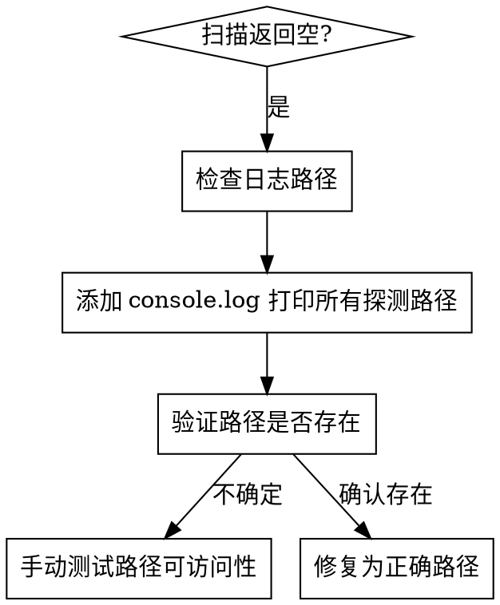

# Debugging Electron Repo Scanning

## Overview

Electron应用中Claude Code仓库扫描返回0结果时的调试方法论。核心问题：Claude Code配置路径因安装方式不同而异，需要多路径探测。

## When to Use

**Symptoms:**
- `repos:scan` IPC调用返回空数组 `[]`
- 日志显示 "Total repos found: 0"
- UI显示"暂无仓库数据"
- 仓库确实存在但扫描不到

**Trigger:** 调用 `window.electronAPI.scanRepos()` 后返回空结果

## Root Cause Pattern

Claude Code 配置路径不唯一，常见路径：

| 平台 | 路径 |
|------|------|
| Windows | `~/.claude/projects` |
| Windows | `~/.claude/repos` |
| macOS | `~/Library/Application Support/Claude/projects` |
| Linux | `~/.config/Claude/projects` |

## Debugging Flow



## Quick Debug Steps

### 1. 检查 Electron Main Process 日志

在 `src/main/index.ts` 的 `repos:scan` handler 中添加日志：

```typescript
ipcMain.handle('repos:scan', async () => {
  const possiblePaths = [
    join(app.getPath('home'), '.claude', 'projects'),
    join(app.getPath('home'), '.claude', 'repos'),
    // ... 其他路径
  ]

  log.info('Scanning for repos, checking paths:', possiblePaths)

  for (const claudeConfigPath of possiblePaths) {
    if (existsSync(claudeConfigPath)) {
      log.info('Found config path:', claudeConfigPath)
      // ... 扫描逻辑
    }
  }
})
```

### 2. 运行应用并观察日志

```bash
npm run dev
```

观察控制台输出，确认：
- 哪些路径被检查了
- 哪些路径实际存在 (`Found config path:`)
- 扫描到了多少仓库 (`Total repos found:`)

### 3. 验证路径存在性

如果日志显示路径存在但未扫描到仓库，手动检查：

```bash
# Windows
dir %USERPROFILE%\.claude\projects

# macOS/Linux
ls -la ~/.claude/projects
```

### 4. 常见修复

**问题：** 路径 `app.getPath('userData')/claude-repos` 不存在

**修复：** 使用 `app.getPath('home')` 获取用户主目录：

```typescript
const possiblePaths = [
  join(app.getPath('home'), '.claude', 'projects'),  // 主目录下的 .claude/projects
  join(app.getPath('home'), '.claude', 'repos'),
]
```

### 5. 验证修复

修复后重启应用，检查日志：

```
Scanning for repos, checking paths: [...]
Found config path: C:\Users\xxx\.claude\projects
Added repo: xxx
Total repos found: 8
```

## Key Insight

**Electron Main Process vs Renderer Process:**

- Main process 有完整文件系统访问权限
- Renderer process (React) 通过 IPC 调用 main process
- 日志应在 main process 中查看，不是 renderer console

## Common Mistakes

| 错误 | 正确做法 |
|------|----------|
| 只检查一个路径 | 同时检查多个可能的路径 |
| 在 renderer 加日志 | 在 main process 加日志 |
| 假设路径固定 | 路径因平台和安装方式而异 |
| 忽略错误处理 | 添加 try-catch 跳过无法访问的目录 |

## Real Example

从日志发现问题：
```
Scanning for repos, checking paths: [..., C:\Users\xxx\AppData\Roaming\ai-manager\claude-repos, ...]
```

这个路径 `AppData/Roaming/ai-manager/claude-repos` 不存在，因为这是应用数据目录而非 Claude Code 配置目录。

**修复：** 改为 `~/.claude/projects`：
```typescript
join(app.getPath('home'), '.claude', 'projects')
```
